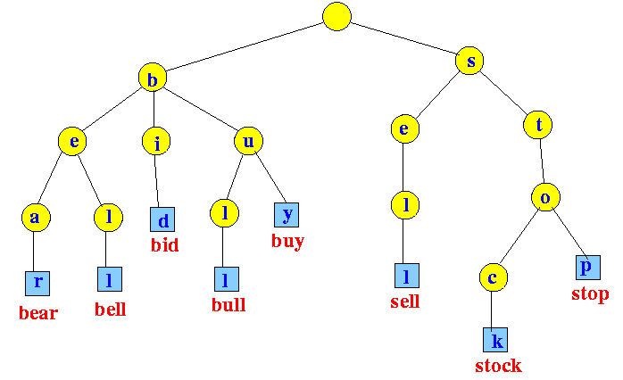

<!-- PROJECT LOGO -->
<br />
<div align="center">
  <a href="https://github.com/rom1trt/mini-search-engine">
    
  </a>

<h3 align="center">Mini Search Engine</h3>

  <p align="center">
    A Trie structure search engine that enables to search for words in a database or documents
    <br />
    <a href="https://github.com/rom1trt/mini-search-engine"><strong>Explore the docs »</strong></a>
    <br />
    <br />
    <a href="https://github.com/rom1trt/mini-search-engine">View Demo</a>
    ·
    <a href="https://github.com/rom1trt/mini-search-engine/issues">Report Bug</a>
  </p>
</div>

<!-- TABLE OF CONTENTS -->
<details>
  <summary>Table of Contents</summary>
  <ol>
    <li>
      <a href="#about-the-project">About The Project</a>
      <ul>
        <li><a href="#built-with">Built With</a></li>
      </ul>
    </li>
    <li>
      <a href="#getting-started">Getting Started</a>
      <ul>
        <li><a href="#installation">Installation</a></li>
      </ul>
    </li>
    <li><a href="#usage">Usage</a></li>
    <li><a href="#license">License</a></li>
  </ol>
</details>

<!-- ABOUT THE PROJECT -->

## About The Project

What a Search Engine basically does is, it finds a particular "Sentence and its related content" on a click and then it goes on backside, it searches each word in the query and its nearest related and relevant contents that is available in Internet among millions of Web Pages. Search Engines uses Web crawling, Indexing and Searching to find the particular "search" on the Internet. Though the search is far more complex, in this project, I implemented a simpler search engine which ...

## Trie

[](https://en.wikipedia.org/wiki/Trie)

In computer science, a trie, also called digital tree or prefix tree, is a kind of search tree—an ordered tree data structure used to store a dynamic set or associative array where the keys are usually strings.

Unlike a binary search tree, no node in the tree stores the key associated with that node; instead, its position in the tree defines the key with which it is associated; i.e., the value of the key is distributed across the structure. All the descendants of a node have a common prefix of the string associated with that node, and the root is associated with the empty string. Keys tend to be associated with leaves, though some inner nodes may correspond to keys of interest. Hence, keys are not necessarily associated with every node.



## Applications

- Looking up data in a trie is faster in the worst case, O(m) time (where m is the length of a search string), compared to an imperfect hash table. An imperfect hash table can have key collisions. A key collision is the hash function mapping of different keys to the same position in a hash table. The worst-case lookup speed in an imperfect hash table is O(N) time, but far more typically is O(1), with O(m) time spent evaluating the hash.
- There are no collisions of different keys in a trie.
- There is no need to provide a hash function or to change hash functions as more keys are added to a trie.
- A trie can provide an alphabetical ordering of the entries by key.

### Built With

[![C++][c++]][c++-url]
[![Python][python]][python-url]
[![MongoDB][mongodb]][mongodb-url]
[![Docker][docker]][docker-url]

<!-- GETTING STARTED -->

## Getting Started

These are instructions on how you may set up your project locally.
To get a local copy up and running follow these simple example steps.

### Installation

1. Clone the repository

```
git clone https://github.com/rom1trt/mini-search-engine.git
```

```
cd mini-search-engine
```

2. Compile the project

```
make
```

3. Install Python dependencies <br>

```
pip install -r requirements.txt
```

or

```
pip3 install -r requirements.txt
```

4. Launch program on desired datasets/<file> (Local)

```

./searchengine -d <document-path> -k <best-datasets>:int

```

### Optional (Store your documents in a database)

#### On MongoDB Atlas

4. Create an account on MongoDB Atlas <br>
   [![MongoDB][mongodb2]][mongodb-url]
5. Store your username and password in a `.env` file
6. Replace the `conn_str` by yours obtained on MongoDB Atlas
7. Run `main.py` and visit MongoDB Atlas dashboard

#### Or docker container

4. Launch Docker and deploy docker-compose.yaml file <br>
   `docker-compose up`
5. Uncomment line 21 and comment lines 18 & 24 to connect to the local database
6. Run `main.py`
7. Interact with your local database web-based interface <br>
   `http://localhost:8081/`

<!-- USAGE EXAMPLES -->

## Usage

The mini-search-engine enables 3 types of search:

### How many times a word is present in a specific document

```

/tf <document-id> <word>

```

#### Result

```

<document-id> <word> <number-of-occurrences>

```

### How many documents contain(s) a specific word 

```

/df <word>

```
### How many times a word is present in the whole database

```

/df

```

#### Result

```

<word> <number-of-occurrences>

```

```

List every word and their occurrences

```

### Search

```

/search <word1> <word2> ...

```

#### Result

```

<document-number> <pertinence-result> <text + searched-word(s)-underlined>

```

### Exit

```

/exit

```

#### Result

```

Exiting...

```

<!-- LICENSE -->

## License

Distributed under the MIT License. See `LICENSE` for more information.

<!-- MARKDOWN LINKS & IMAGES -->

[c++]: https://img.shields.io/badge/C%2B%2B-grey?style=for-the-badge&logo=c%2B%2B&logoColor=white
[c++-url]: https://cplusplus.com/
[python]: https://img.shields.io/badge/Python-3776AB?style=for-the-badge&logo=python&logoColor=white
[python-url]: https://www.python.org/
[mongodb]: https://img.shields.io/badge/MongoDB-4EA94B?style=for-the-badge&logo=mongodb&logoColor=white
[mongodb2]: https://img.shields.io/badge/MongoDB-4EA94B??style=flat-square&logo=appveyor&logo=mongodb&logoColor=white
[mongodb-url]: https://www.mongodb.com/atlas/database
[docker]: https://img.shields.io/badge/docker-0096FF?style=for-the-badge&logo=docker&logoColor=white
[docker-url]: https://www.docker.com/
